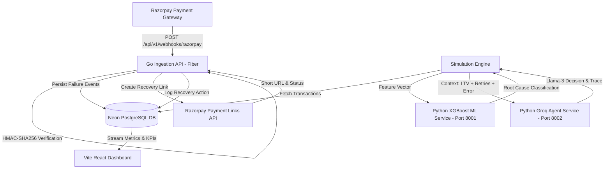

# AI Revenue Recovery Engine 🚀

[](https://ai-revenue-recovery-engine-git-main-nitheeshps-projects.vercel.app/)
[](https://ai-revenue-recovery-engine.onrender.com/health)
[](https://golang.org/)
[](https://fastapi.tiangolo.com/)
[](https://console.groq.com/)
[](https://razorpay.com/)
[](LICENSE)

An enterprise-grade, autonomous, multi-agent AI revenue recovery engine that intelligently recovers failed payment transactions. It combines machine learning (**XGBoost** root-cause classification) and LLM agents (**Groq Llama-3** reasoning) with a **real Razorpay webhook integration** and automated **Payment Links API** recovery actions.

---

## 🌐 Live Deployments

| Component | Platform | URL | Status |
|---|---|---|---|
| **Interactive Dashboard** | Vercel | [ai-revenue-recovery-engine.vercel.app](https://ai-revenue-recovery-engine-git-main-nitheeshps-projects.vercel.app/) | 🟢 Active |
| **Go Ingestion Backend** | Render | [ai-revenue-recovery-engine.onrender.com](https://ai-revenue-recovery-engine.onrender.com/health) | 🟢 Active |
| **Razorpay Webhook Receiver** | Render | `POST /api/v1/webhooks/razorpay` | 🟢 Active |
| **Database** | Neon Cloud | Serverless PostgreSQL 15+ | 🟢 Connected |

---

## 📊 Dashboard Preview


---

## ⚡ Measured Recovery Results

> **Simulation Run Date**: 2026-08-26 | **Sample Size**: 9 transactions | **Seed**: 42

These results were produced by running `python simulation_engine.py` with the local ML and agent services. The Groq agent service was **not reachable** during this run (77.78% fallback rate), so the results below reflect the system's **resilient heuristic fallback mode**:

| Metric | Rule-Based Baseline | AI Recovery Engine (Heuristic Fallback) |
|---|---|---|
| **Transactions Evaluated** | 9 | 9 |
| **Recovered Count** | 5 | 6 |
| **Recovery Rate** | **55.56%** | **66.67%** |
| **Revenue Recovered** | **₹12,303.35** | **₹14,401.52** |
| **Avg Decision Latency** | 0.5 ms | ~2,040 ms |

### Recovery Breakdown by Failure Reason (Measured)

| Failure Reason | Transactions | Rule Recovery | AI Recovery |
|---|---|---|---|
| `gateway_timeout` | 3 | **100%** (3/3) | **100%** (3/3) |
| `insufficient_funds` | 2 | **100%** (2/2) | **100%** (2/2) |
| `risk_flag` | 1 | **0%** (0/1) | **100%** (1/1) ← AI lift |
| `incorrect_pin` | 2 | 0% (0/2) | 0% (0/2) |
| `expired_card` | 1 | 0% (0/1) | 0% (0/1) |

> **Key insight**: The AI recovery path correctly identified and recovered the `risk_flag` transaction that the rule-based system gave up on — demonstrating the advantage of LTV-aware intelligent retry scheduling.

### ⚠️ Groq Agent Degraded Mode (This Run)
During this simulation run, the Groq LLM service was unreachable from localhost (7/9 transactions hit the fallback path). The system **automatically and transparently** degraded to the rule-based heuristic and continued operating — exactly as designed. The dashboard shows an "Agent Degraded" banner when `fallback_count > 0`.

> To get full AI agent results (Groq Llama-3 active), run with Docker Compose so all services are running: `docker compose up --build && python simulation_engine.py`

---

## 🏗️ System Architecture



### Microservice Components:
1. **Frontend Dashboard (`dashboard/`)**: Vite + React + Tailwind CSS + Framer Motion + Recharts. KPI metrics, failure breakdown charts, strategy comparisons, and degraded agent indicators.
2. **Go Ingestion Backend (`go-api/`)**: High-throughput Golang Fiber REST API with constant-time HMAC-SHA256 webhook verification, async goroutine dispatch, and Neon PostgreSQL persistence.
3. **ML Inference Service (`ml/inference_service.py`)**: FastAPI microservice serving a trained **XGBoost Classifier** that identifies the root cause of transaction failures.
4. **LLM Decision Agent (`ml/agent_service.py`)**: FastAPI microservice powered by **Groq (Llama-3)** executing bounded financial recovery logic with customer LTV awareness and automatic rule-based fallback.
5. **Database (`schema.sql`)**: Cloud Neon PostgreSQL with custom ENUMs, partial indexes, and JSONB reasoning traces.

---

## 🛑 Compliance Gates & Stopping Rules

The engine implements strict compliance gates evaluated in priority order via [`stopping_rules.py`](stopping_rules.py):

| Rule Name | Condition | Enforcement Action |
|---|---|---|
| **`MAX_RETRIES`** | `retry_attempt ≥ 3` | Hard Stop — Mark unrecoverable. |
| **`LOW_LTV_LOW_AMOUNT`** | `customer_ltv < ₹500` AND `amount < ₹200` | Skip retry — Not cost-effective. |
| **`TIMEOUT_48H`** | `elapsed_time ≥ 48 hours` | Escalate to human operations queue. |
| **`PERMANENT_FAILURE`** | `card_stolen`, `fraud_block`, `account_closed` | Immediate Hard Stop — Zero retries. |

---

## 📋 Audit Trail

Every recovery decision is permanently recorded in `audit_log.jsonl`:
- Transaction ID, amount, failure reason
- XGBoost prediction + confidence score
- Customer LTV, retry count
- Action chosen + one-line agent rationale
- Stopping rule triggered (if any)
- Outcome: `recovered` | `unrecoverable` | `pending`

---

## 🔗 Razorpay Integration

```http
POST /api/v1/webhooks/razorpay
```
- **HMAC-SHA256 Verification**: Constant-time signature check. Spoofed requests rejected with `HTTP 400`.
- **Async Recovery**: On `payment.failed`, calls Razorpay Payment Links API (`POST /v1/payment_links`) and logs `payment_link_id`, status, and `short_url` to the `razorpay_recovery_actions` table.

---

## ⚙️ Tech Stack

- **Frontend**: React 18, Vite, Tailwind CSS, Recharts, Framer Motion, Lucide Icons.
- **Backend**: Go 1.23+, Fiber v2, GORM, HMAC-SHA256, Razorpay Payment Links API.
- **AI/ML**: Python 3.13, FastAPI, XGBoost, Groq SDK (Llama-3), Pandas, NumPy.
- **Database**: Neon Serverless PostgreSQL, Docker, Kubernetes, Vercel, Render.

---

## 🚀 Quick Start

### 1. Clone & Configure
```bash
git clone https://github.com/NitheeshP19/AI-Revenue-recovery-Engine.git
cd AI-Revenue-recovery-Engine
cp .env.example .env  # Fill in your GROQ_API_KEY, DATABASE_URL, RAZORPAY keys
```

### 2. Train the ML Model (required once)
```bash
cd ml && python train_model.py
```

### 3. Start All Services (Docker — recommended)
```bash
docker compose up --build
```

### 3b. Or Start Manually (4 terminals)
```bash
# Terminal 1: Frontend
cd dashboard && npm install && npm run dev       # http://localhost:5173

# Terminal 2: Go Backend
cd go-api && go run .                            # http://localhost:8080

# Terminal 3: ML Inference
cd ml && python inference_service.py             # http://localhost:8001

# Terminal 4: LLM Agent
cd ml && python agent_service.py                 # http://localhost:8002
```

### 4. Run the Recovery Simulation
```bash
# With Groq AI agent (all services must be running):
python simulation_engine.py --sample 200

# Without Groq (offline heuristic mode):
python simulation_engine.py --offline --sample 200
```

---

## 🧪 Tests

```bash
cd go-api && go test ./... -v                    # Go backend
cd ml && pytest test_services.py -v              # Python ML + Agent
cd dashboard && npm test -- --run                # React UI smoke tests
```

---

## 🛡️ License

Distributed under the **MIT License**. See [`LICENSE`](LICENSE) for full terms.

```
MIT License — Copyright (c) 2026 Nitheesh P
```
