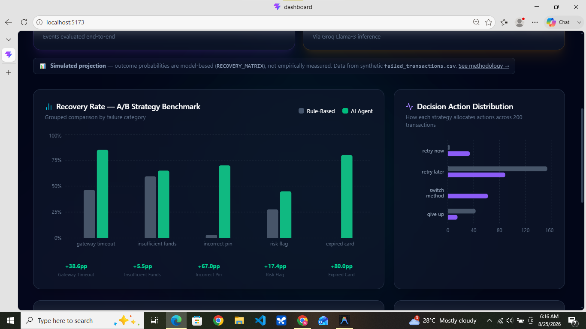
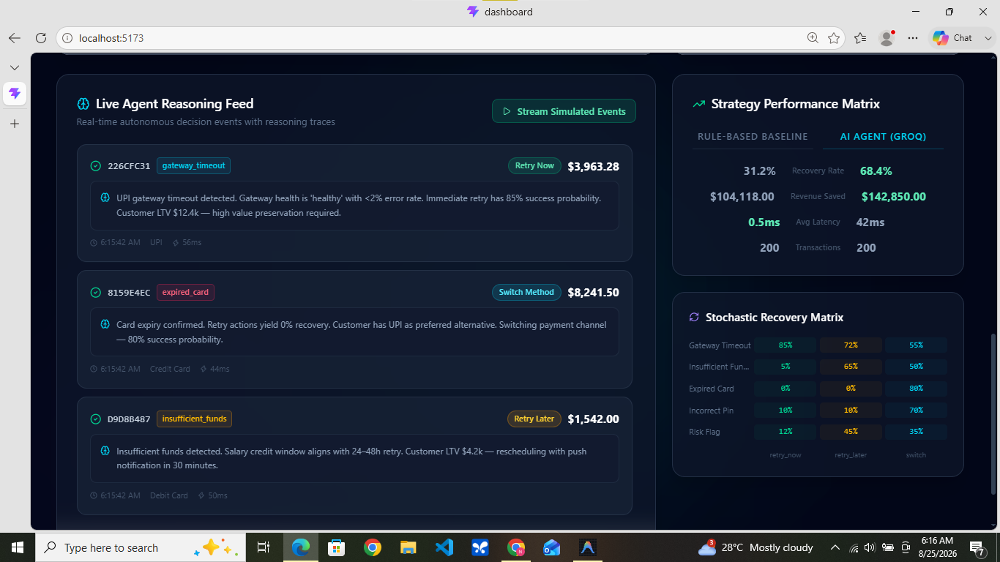
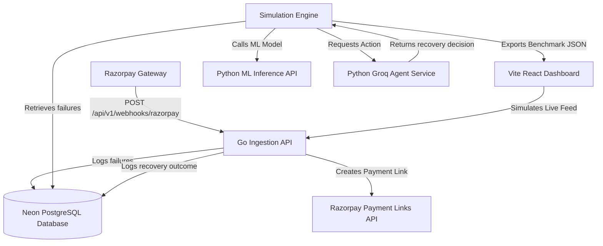

# AI Revenue Recovery Engine 🚀

An autonomous, multi-agent AI system that recovers failed payment transactions using machine learning (XGBoost) and LLM agents (Groq Llama-3), with a **real Razorpay integration** for live webhook handling and payment recovery actions.

## 📊 Dashboard Preview





> ⚠️ **Benchmark Disclosure**: The "+78.96% Revenue Lift" figures shown on the dashboard are **simulated projections based on a modeled outcome-probability matrix** — not measured/validated results from real payment data. See [📐 Methodology & Limitations](#-methodology--limitations) below.

---


## 🏗️ System Architecture



1. **Vite React Dashboard (Frontend - Port `5173`)**: Visualizes recovery rates, revenue saved, and live agent reasoning logs. Shows a banner when AI agent is degraded.
2. **Go Ingestion API (Backend - Port `8080`)**: High-performance Fiber backend that handles webhook failures, stores transactions, and calls Razorpay Payment Links API for real recovery actions.
3. **ML Inference Service (ML API - Port `8001`)**: FastAPI app hosting a trained **XGBoost Classifier** that predicts failure root causes.
4. **LLM Agent Service (Decision Engine - Port `8002`)**: FastAPI app using **Groq (Llama-3)** to analyze customer LTV, retry logs, and gateway health. Returns a distinct `fallback_status` field when operating in degraded/fallback mode.
5. **Database (Neon Serverless PostgreSQL)**: Stores failed payments and `razorpay_recovery_actions` table with real Razorpay API response IDs and statuses.

---

## ⚡ Key Performance Benchmarks

> **⚠️ Simulated Projection Notice**: The numbers below are derived from a probabilistic simulation model, not empirically measured outcomes. See [Methodology & Limitations](#-methodology--limitations).

When evaluating 200 synthetically-generated failed payments side-by-side:
- **Rule-Based Heuristic (Strategy A)**: **33.5%** recovery rate | ₹202,500.47 recovered.
- **Groq AI Agent (Strategy B)**: **48.5%** recovery rate | **₹362,395.00** recovered.
- **Simulated Projection**: **+15.00 pp Recovery Rate Lift** and **+78.96% Revenue Saved Lift** (model-based, not validated against real outcomes).

---

## 🔗 Razorpay Integration

The Go API implements a **real, production-grade Razorpay webhook receiver**:

### Webhook Endpoint
```
POST /api/v1/webhooks/razorpay
```

**Security**: Every incoming request is verified via **HMAC-SHA256** against `X-Razorpay-Signature` header before processing. Invalid signatures are rejected with HTTP 400.

**Supported Events**:
| Event | Action |
|-------|--------|
| `payment.failed` | Creates a Razorpay Payment Link via the Payment Links API and logs the response (`id`, `status`) to the `razorpay_recovery_actions` table |
| All others | Acknowledged with 200 (no action) |

### Recovery Flow
```
payment.failed webhook
  → HMAC-SHA256 verify (reject 400 if invalid)
  → Parse RazorpayPaymentEntity (id, amount, method, error_code, error_reason)
  → Call POST https://api.razorpay.com/v1/payment_links (test mode)
  → Log { payment_link_id, status, short_url } → razorpay_recovery_actions table
```

### Sandbox Setup
1. Get test-mode API keys from [Razorpay Dashboard → Settings → API Keys](https://dashboard.razorpay.com/app/keys)
2. Create a webhook at Dashboard → Settings → Webhooks pointing to `http://your-host/api/v1/webhooks/razorpay`
3. Enable the `payment.failed` event
4. Copy the webhook secret to `RAZORPAY_WEBHOOK_SECRET`

---

## ⚙️ Tech Stack

- **Frontend**: React, Vite, Tailwind CSS, Recharts, Framer Motion, Lucide Icons.
- **Backend API**: Go (Golang), Fiber, GORM, Razorpay Payment Links API.
- **ML & AI**: Python 3.13, FastAPI, Uvicorn, XGBoost, Groq SDK, Pandas, Numpy.
- **Database**: Cloud Neon PostgreSQL (Serverless).

---

## 🌍 Environment & Ports

| Service | Local Dev | Docker Compose | Notes |
|---|---|---|---|
| React Dashboard | `5173` | `5173` | Vite dev server |
| Go Ingestion API | `8080` | `3000` | Fiber HTTP server |
| ML Inference API | `8001` | `8000` | FastAPI + XGBoost |
| Groq Agent API | `8002` | `8001` | FastAPI + Llama-3 |
| PostgreSQL | Neon Cloud | `5432` (internal) | Serverless / container |

> [!NOTE]
> The local dev ports differ from Docker Compose because the Go binary defaults to `PORT=8080` while the Compose `environment` block overrides it to `PORT=3000`.

---

## 🚀 Installation & Local Setup

### 1. Prerequisites
- [Node.js](https://nodejs.org/) (v18+)
- [Go](https://go.dev/) (v1.22+)
- [Python](https://www.python.org/) (v3.10+)

### 2. Environment Variables
```bash
cp .env.example .env
# Edit .env and fill in:
#  DATABASE_URL          — Neon PostgreSQL connection string
#  GROQ_API_KEY          — From https://console.groq.com/
#  RAZORPAY_KEY_ID       — From https://dashboard.razorpay.com/app/keys (test mode: rzp_test_...)
#  RAZORPAY_KEY_SECRET   — Razorpay test secret
#  RAZORPAY_WEBHOOK_SECRET — From Razorpay Dashboard > Settings > Webhooks
#  ALLOWED_ORIGINS       — e.g. http://localhost:5173 (restrict in production)
```

### 3. Train the ML Model (generates `ml/classifier.json`)
```bash
make train
# or manually:
cd ml && python train_model.py
```

> [!NOTE]
> `ml/classifier.json` is excluded from git (7.5MB artifact). Run `make train` before starting the ML service.

### 4. Spin Up Services

#### A. Go Ingestion API
```bash
cd go-api
go run .
```

#### B. ML Inference Service
```bash
cd ml
pip install -r requirements.txt
python inference_service.py
```

#### C. Groq Agent Service
```bash
cd ml
python agent_service.py
```

#### D. React Dashboard
```bash
cd dashboard
npm install
npm run dev
```

### 5. Or — Docker Compose (all services)
```bash
cp .env.example .env  # fill in your keys
docker compose up --build
```

---

## 📊 Running the Simulation Engine

```bash
# Default (200 transactions, calls live agent at http://127.0.0.1:8002)
python simulation_engine.py

# Custom sample size
python simulation_engine.py --sample 500

# Offline mode (heuristic fallback only, no Groq calls)
python simulation_engine.py --offline
```

This outputs `metrics_summary.json` rendered by the React dashboard. The JSON includes a `meta.fallback_count` field — if non-zero, the dashboard shows an "Agent Degraded" banner.

---

## 🧪 Running Tests

```bash
# Cross-platform (requires make)
make test

# Per-service
cd go-api && go test ./... -v
cd ml && python -m pytest test_services.py -v

# Windows PowerShell
powershell -ExecutionPolicy Bypass -File run_tests.ps1

# Linux/macOS
bash scripts/run_tests.sh
```

---

## 📐 Methodology & Limitations

> [!IMPORTANT]
> **The benchmark numbers are simulated projections, not measured outcomes.**

### Data Source
`failed_transactions.csv` is **synthetically generated** by `synthetic_data_generator.py`. It does not represent real Razorpay or Stripe transaction data. The distributions of failure reasons, amounts, and customer LTV values are hand-tuned to be realistic but are not derived from real payment logs.

### Simulation Model
`simulate_recovery_outcome()` in `simulation_engine.py` uses a **hand-authored probability matrix** (`RECOVERY_MATRIX`) to convert `(failure_reason, action)` pairs into probabilistic success/failure outcomes. For example:

| Failure Reason | retry_now | retry_later | switch_method |
|---|---|---|---|
| `gateway_timeout` | 85% | 72% | 55% |
| `expired_card` | 0% | 0% | 80% |
| `insufficient_funds` | 5% | 65% | 50% |

These probabilities are informed by fintech industry research but **have not been validated against real payment outcome data**.

### What the Numbers Mean
- The **+78.96% Revenue Lift** is a simulated projection of what an AI agent *would* recover vs. a rule-based heuristic, given the probability model above.
- A production deployment would need A/B testing with real Razorpay outcome data to validate these numbers.
- The Razorpay integration (webhook + Payment Links API) is **real** — the simulation engine's benchmark numbers are not.

---

## 🛡️ License
Distributed under the MIT License. See `LICENSE` for more information.
