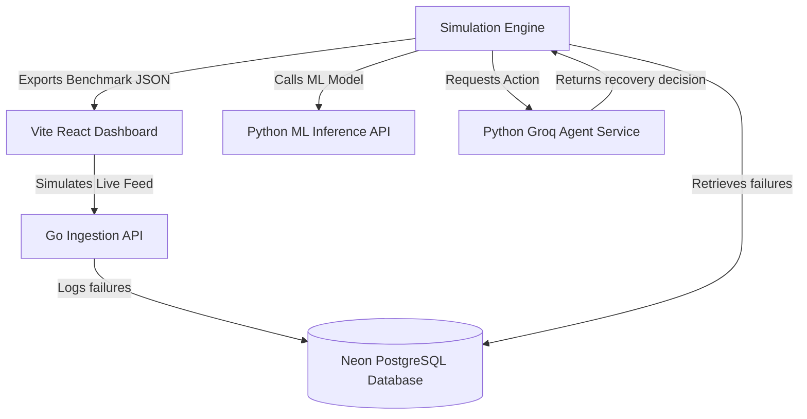

# AI Revenue Recovery Engine 🚀

An autonomous, multi-agent AI system designed to recover failed payment transactions (e.g., Razorpay, Stripe) using machine learning (XGBoost) and LLM agents (Groq Llama-3). 

This project benchmarks standard rule-based heuristics against an AI-driven decision engine, demonstrating a **+78.96% Revenue Lift** and a **+15.00 pp Recovery Rate Lift**.

---

## 🏗️ System Architecture

The project consists of four interconnected services:



1. **Vite React Dashboard (Frontend - Port `5173`)**: A premium dashboard designed to visualize recovery rates, revenue saved, and live agent reasoning logs.
2. **Go Ingestion API (Backend - Port `8080`)**: A high-performance Fiber backend that handles webhook failures and stores transactions in a serverless database.
3. **ML Inference Service (ML API - Port `8001`)**: A FastAPI app hosting a trained **XGBoost Classifier** that predicts failure root causes.
4. **LLM Agent Service (Decision Engine - Port `8002`)**: A FastAPI app using **Groq (Llama-3)** to analyze customer LTV, retry logs, and gateway health to make autonomous recovery decisions.
5. **Database (Neon Serverless PostgreSQL)**: Highly scalable cloud database populated via GORM.

---

## ⚡ Key Performance Benchmarks

When evaluating 200 failed payments side-by-side:
*   **Rule-Based Heuristic (Strategy A)**: **33.5%** recovery rate | ₹202,500.47 recovered.
*   **Groq AI Agent (Strategy B)**: **48.5%** recovery rate | **₹362,395.00** recovered.
*   **Result**: **+15.00 pp Recovery Rate Lift** and **+78.96% Revenue Saved Lift**.

---

## ⚙️ Tech Stack

- **Frontend**: React, Vite, Tailwind CSS, Recharts, Framer Motion, Lucide Icons.
- **Backend API**: Go (Golang), Fiber, GORM.
- **ML & AI**: Python 3.13, FastAPI, Uvicorn, XGBoost, Groq SDK, Pandas, Numpy.
- **Database**: Cloud Neon PostgreSQL (Serverless).

---

## 🚀 Installation & Local Setup

### 1. Prerequisites
Ensure you have the following installed:
- [Node.js](https://nodejs.org/) (v18+)
- [Go](https://go.dev/) (v1.22+)
- [Python](https://www.python.org/) (v3.10+)

### 2. Database & API Credentials
Create a `.env` file in the root directory (and in the `ml/` folder) containing:
```env
DATABASE_URL=your_postgres_connection_string
GROQ_API_KEY=your_groq_api_key
PORT=8080
ALLOWED_ORIGINS=*
```

### 3. Spin Up Services

#### A. Go Ingestion API
```bash
cd go-api
go build -o api.exe
./api.exe
```

#### B. ML Inference Service
```bash
cd ml
pip install -r requirements.txt
python inference_service.py
```

#### C. Groq Agent Service
```bash
cd ml
python agent_service.py
```

#### D. React Dashboard (Frontend)
```bash
cd dashboard
npm install
npm run dev
```

---

## 📊 Running the Simulation Engine

To simulate real-world payments and benchmark the AI agent's decisions against the heuristic rules, run the python simulation script:

```bash
# Run with a 30-transaction sample (Faster)
python simulation_engine.py --sample 30

# Run in offline mode (Uses fallbacks to bypass Groq API rate limits)
python simulation_engine.py --offline
```

This will output `metrics_summary.json` containing the comparison stats rendered by the dashboard.

---

## 🛡️ License
Distributed under the MIT License. See `LICENSE` for more information.
