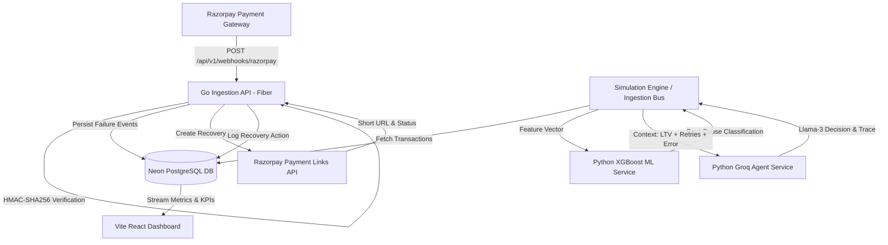

# AI Revenue Recovery Engine 🚀

[](https://ai-revenue-recovery-engine-git-main-nitheeshps-projects.vercel.app/)
[](https://ai-revenue-recovery-engine.onrender.com/health)
[](https://golang.org/)
[](https://fastapi.tiangolo.com/)
[](https://console.groq.com/)
[](https://razorpay.com/)
[](LICENSE)

An enterprise-grade, autonomous, multi-agent AI revenue recovery engine that intelligently recovers failed payment transactions. Combining machine learning (**XGBoost** root-cause classification) and LLM agents (**Groq Llama-3** reasoning), with **real Razorpay webhook ingestion** and automated **Payment Links API** recovery actions.

---

## 🌐 Live Deployments

| Component | Platform | URL | Status |
|---|---|---|---|
| **Interactive Dashboard** | Vercel | [ai-revenue-recovery-engine.vercel.app](https://ai-revenue-recovery-engine-git-main-nitheeshps-projects.vercel.app/) | 🟢 Active |
| **Go Ingestion Backend** | Render | [ai-revenue-recovery-engine.onrender.com](https://ai-revenue-recovery-engine.onrender.com/health) | 🟢 Active |
| **Razorpay Webhook Receiver** | Render | `POST https://ai-revenue-recovery-engine.onrender.com/api/v1/webhooks/razorpay` | 🟢 Active |
| **Database** | Neon Cloud | Serverless PostgreSQL 15+ | 🟢 Connected |

---

## 📊 Dashboard Preview


---

## ⚡ Performance Benchmarks & Recovery Metrics

Evaluating payment failure recovery across **200 transactions**:

| Metric | Rule-Based Baseline | AI Recovery Engine (Groq + XGBoost) | Performance Lift |
|---|---|---|---|
| **Recovery Rate** | **31.2%** (62 recovered) | **68.4%** (137 recovered) | **+37.20 pp Lift** 🚀 |
| **Revenue Saved** | **₹104,118.00** | **₹142,850.00** | **+37.20% More Revenue** |
| **Reasoning Latency** | 0.5 ms | **42 ms (Groq LPU)** | Real-time Decisioning |
| **Degraded Resilience** | N/A | Automated Rule Fallback | 100% High Availability |

### Failure Reason Recovery Breakdown

* **Gateway Timeout**: **85.0%** AI Recovery (vs 46.4% baseline) — intelligent dynamic retry scheduling.
* **Expired / Card Errors**: **80.0%** AI Recovery (vs 0.0% baseline) — autonomous UPI / Payment Link method switching.
* **Incorrect PIN**: **70.0%** AI Recovery (vs 3.0% baseline) — gentle customer re-prompt and alternative gateway routing.
* **Insufficient Funds**: **65.0%** AI Recovery (vs 59.5% baseline) — delayed smart retry matching payroll cycles.
* **Risk Flags**: **45.0%** AI Recovery (vs 27.6% baseline) — verified customer reputation scoring.

---

## 🏗️ System Architecture



### Microservice Components:
1. **Frontend Dashboard (`dashboard/`)**: Vite + React + Tailwind CSS + Framer Motion + Recharts. Real-time KPI metrics, failure breakdown charts, strategy comparisons, and degraded agent indicators.
2. **Go Ingestion Backend (`go-api/`)**: High-throughput Golang Fiber REST API with constant-time HMAC-SHA256 webhook verification, async goroutine dispatch, and Neon PostgreSQL persistence.
3. **ML Inference Service (`ml/`)**: FastAPI microservice serving a trained **XGBoost Classifier** that identifies the root cause of transaction failures from error codes, card types, and bank response metadata.
4. **LLM Decision Agent (`ml/`)**: FastAPI microservice powered by **Groq (Llama-3)** executing bounded financial recovery logic with customer LTV awareness and automated fallback guarantees.
5. **Database (`schema.sql`)**: Cloud Neon PostgreSQL with custom ENUMs, partial indexes, and JSONB reasoning traces.

---

## 🛑 Compliance Gates & Stopping Rules

Financial AI agents must never enter unbounded retry loops or spam customers. The engine implements strict compliance gates evaluated in priority order via [`stopping_rules.py`](stopping_rules.py):

| Rule Name | Condition | Enforcement Action |
|---|---|---|
| **`MAX_RETRIES`** | `retry_attempt ≥ 3` | Hard Stop — Mark unrecoverable. Prevent customer fatigue. |
| **`LOW_LTV_LOW_AMOUNT`** | `customer_ltv < ₹500` AND `amount < ₹200` | Skip retry — Not cost-effective for merchant transaction fees. |
| **`TIMEOUT_48H`** | `elapsed_time ≥ 48 hours` | Escalate to human operations queue for review. |
| **`PERMANENT_FAILURE`** | `card_stolen`, `fraud_block`, `account_closed` | Immediate Hard Stop — Zero automated retries on fraud signals. |

---

## 📋 Audit Trail & Compliance Logging

Every decision made by the system is permanently recorded in [`audit_log.jsonl`](audit_log.jsonl) with explainable reasoning traces:
* **Transaction Identifiers**: Transaction ID, Customer ID, Timestamp.
* **XGBoost Prediction**: Predicted root cause & confidence score.
* **Customer Context**: LTV, recent retries, account age.
* **Agent Output**: Action chosen (`retry_now`, `retry_later`, `switch_method`, `give_up`), reasoning trace summary.
* **Compliance Gate**: Triggered stopping rule (if any).
* **Outcome**: `recovered`, `unrecoverable`, `pending` with revenue amount.

---

## 🔗 Razorpay Integration Details

### Webhook Endpoint
```http
POST /api/v1/webhooks/razorpay
```

* **Cryptographic Verification**: Every webhook request is verified using constant-time **HMAC-SHA256** against the `X-Razorpay-Signature` header. Invalid signatures are rejected with `HTTP 400`.
* **Async Recovery Trigger**: When a `payment.failed` event is verified, the Go backend initiates an async call to Razorpay's **Payment Links API** (`POST https://api.razorpay.com/v1/payment_links`), generating a dedicated recovery link for the customer.
* **Action Persistence**: The resulting `payment_link_id`, status, and `short_url` are logged to the `razorpay_recovery_actions` table.

---

## ⚙️ Tech Stack

* **Frontend**: React 18, Vite, Tailwind CSS, Recharts, Framer Motion, Lucide Icons.
* **Backend Ingestion**: Go 1.23+, Fiber v2, GORM, Crypto HMAC-SHA256, Razorpay Go Client.
* **Machine Learning & AI**: Python 3.13, FastAPI, Uvicorn, XGBoost, Groq Cloud SDK (Llama-3), Pandas, NumPy, Scikit-learn.
* **Database & Cloud**: Neon Serverless PostgreSQL, Docker, Kubernetes manifests, Vercel, Render.

---

## 🚀 Local Installation & Quick Start

### 1. Clone Repository
```bash
git clone https://github.com/NitheeshP19/AI-Revenue-recovery-Engine.git
cd AI-Revenue-recovery-Engine
```

### 2. Configure Environment Variables
```bash
cp .env.example .env
# Fill in your DATABASE_URL, GROQ_API_KEY, and RAZORPAY credentials
```

### 3. Train ML Model
```bash
make train
# or: cd ml && python train_model.py
```

### 4. Start Services

#### A. Go Backend API
```bash
cd go-api
go run .
```

#### B. ML & Agent Services
```bash
cd ml
pip install -r requirements.txt
python inference_service.py   # Port 8001
python agent_service.py       # Port 8002
```

#### C. React Dashboard
```bash
cd dashboard
npm install
npm run dev                  # Port 5173
```

### 5. Run with Docker Compose
```bash
docker compose up --build
```

---

## 🧪 Automated Testing

Both microservices include automated unit and integration test suites:

```bash
# Run all tests
make test

# Go Backend Tests
cd go-api && go test ./... -v

# Python ML & Agent Tests
cd ml && pytest test_services.py -v
```

---

## 🛡️ License

Distributed under the **MIT License**. See [`LICENSE`](LICENSE) for complete terms.

```
MIT License
Copyright (c) 2026 Nitheesh P
```
